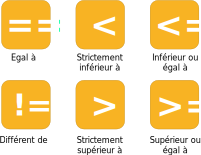

# Les conditions

Une condition est une expression visant à réaliser des actions différentes en fonction d’une valeur. C'est ce qu'on appelle un embranchement, puisque plusieurs branches d'exécution sont possible à partir d'une condition. Dans l'exemple ci-dessous, la condition regarde ce qu'il y a à l'intérieur de la variable *vehicule* et si *vehicule* est un "velo" alors on exécute la branche 1,  sinon on affiche la branche 2.


En java la condition s'écrit de la manière suivante:

```java
if(/*conditions*/)
{
    // branche 1
}
```

Dans ce cas là, une seule branche est exécutée lorsque la condition est correcte. On peut également définir d'autres branches d'exécution en fonction de différentes conditions comme ci-dessous:

```java
if(/*conditions*/)
{
    // branche 1
}
else if (/*conditions*/)
{
	// branche 2
}
else
{
	// branche 3
}
```

Le mot clé *else if* permet de définir une autre condition si la condition précédente n'était pas valide. Il est possible de placer autant de *else if* qu'on le souhaite. Le mot clé *else* permet d'exécuter une branche si aucune des conditions précédentes ne sont pas valides. Les mot clés *else if* et *else* sont optionnels.

Une condition peut se résumer à un test entre deux valeurs. Lorsque deux valeurs sont comparés, on doit utiliser les opérateurs de comparaisons suivants:


# Les boucles

Une boucle n’est ni plus ni moins une répétition des instructions contenues dans la condition tant que cette dernière n’est pas fausse. On peut énoncer une boucle de la façon suivante: « Tant que tu n’as pas la tête qui tourne, fais un tour sur toi-même ». Ici la **condition** est « Est-ce que ta tête ne tourne pas? ». **L’instruction** est « Fais un tour sur toi-même ». L'instruction est répétée tant que la condition n’est pas fausse, c’est-à-dire jusqu'à ce que j'ai « la tête qui tourne ».

En java, pour exprimer une boucle, il existe plusieurs façons. La première ressemble beaucoup à la condition if.

