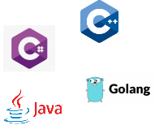
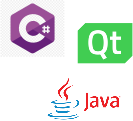

# Les langages de programmation

Il existe de nombreux langages aujourd'hui qui peuvent être classés en grands groupes que l'on appelle des paradigmes. un paradigme est une façon de penser la programmation, ses règles, son exécution.

## Langages impératifs/procédurals

Ce sont des langages qui exécutent une suite d'instructions pour arriver à un certain résultat.

Elles comportent en général 5 type d'instructions:

1. la séquence d'instructions
2. l'assignation ou affectation
3. l'instruction conditionnelle
4. la boucle
5. les branchements


## Langages déclaratifs

Contrairement aux langages impératifs, l'idée ici n'est pas de construire pas à pas les différentes étapes pour obtenir une solution. Les langages déclaratifs raisonnent par le résultat. On écrit ce que l'on veut obtenir et pas comment l'obtenir.

Exemple avec le langage SQL:

```sql
SELECT age FROM table WHERE age > 25;
```

Exemple avec le langage Prolog:

```Prolog
 pere(X,Y) :- parent(X,Y),homme(X). 
        freresoeur(X,Y) :- parent(Z,X), parent(Z,Y).
```

Exemple avec le langage Html:

```html
<!DOCTYPE html>
<html>
<body>

<p>If a browser cannot find the image, it will display the alternate text:</p>


</body>
</html>

```


## Langages Programmation Orienté Objet (POO) / Oriented Object Programmation 

Ces langages impliquent 4 notions fondamentales:

- **Encapsulation**
- **Héritage**
- **Polymorphisme**

Exemple de code:

```java
class Wizard : public Character
{
    // Data
    int _life;
    String[] _powers;
    String _weapon;
    
    public Wizard(int life, String weapon)
    {
        super(life);
        _weapon = weapon;
    }
    
    // Methods
    void Attack(Character enemy)
    {
        enemy.attacked(_weapon.getNbDamages());
    }
    //[...]
}
```


## Langages concurrents

Ces langages sont spécialisés dans l'exécution parallèle de code où l'idée est de réaliser plusieurs tâches en même temps.

Exemple avec Go où 5 jobs sont réalisées en simultanée avec 3 workers:

```go
func worker(id int, jobs <-chan int, results chan<- int) {
    for j := range jobs {
        fmt.Println("worker", id, "started  job", j)
        time.Sleep(time.Second)
        fmt.Println("worker", id, "finished job", j)
        results <- j * 2
    }
}
func main() {
    const numJobs = 5
    jobs := make(chan int, numJobs)
    results := make(chan int, numJobs)
    for w := 1; w <= 3; w++ {
        go worker(w, jobs, results)
    }
    for j := 1; j <= numJobs; j++ {
        jobs <- j
    }
    close(jobs)

    for a := 1; a <= numJobs; a++ {
        <-results
    }
}
```



## Langages évènementiels

Ces langages se basent sur la notion d'évènements. On envoie un évènement depuis un endroit du code comme par exemple : "Hey je viens de cliquer sur le bouton accepter " dans le but que cet évènement peut potentiellement intéressé d'autres endroits du code qui vont traiter cet évènement pour exécuter du code dédié. Par exemple, à un endroit du code il peut se passer la chose suivante après que l'évènement ait été envoyé : "Oh le bouton accepter à été cliqué, ok je vais fermer la fenêtre".




## Langages multi-paradigmes

De plus en plus de langages sont multi-paradigmes en essayant de prendre le meilleur de chacun des paradigmes, ce qui rend le langage de plus en plus complexe.


Sources:

https://spip.teluq.ca/inf6450/spip.php?article115
https://fr.wikipedia.org/wiki/Programmation_d%C3%A9clarative
https://fr.wikipedia.org/wiki/Langage_de_programmation#Paradigmes